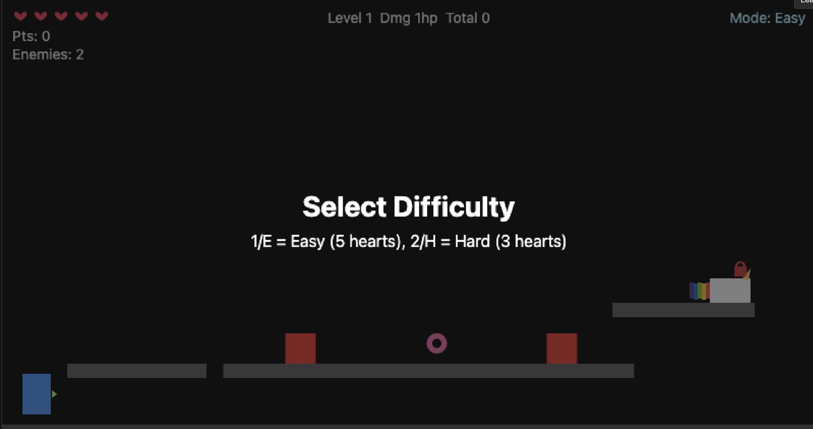

Unicorn Donut Dash – 2D Platformer (OSS)

Overview
- A fast, browser‑based 2D platformer built with HTML5 Canvas + vanilla JS.
- Procedural levels with clear platform spacing, enemies, power‑ups, scoring, and a Neon‑backed leaderboard.

Play
- Local: open `index.html` directly or run `vercel dev` for full API support.
- Deployed: open your Vercel production URL for this project.

Controls
- **Desktop:**
  - On start: choose difficulty — 1/E = Easy (5 hearts), 2/H = Hard (3 hearts)
  - Move: Left/Right arrows
  - Jump: Space (double jump)
  - Shoot: F (aims where you face)
  - Pause/Resume: Esc
  - Reroll level: R
  - Restart (after win/loss): Enter

- **Mobile/Touch:**
  - Virtual joystick (left side): Move left/right
  - JUMP button (right side): Jump (double jump)
  - SHOOT button (right side): Shoot projectiles
  - Touch controls automatically appear on touch-enabled devices

Goal
- Defeat all enemies, then reach the unicorn to clear the level.

Features
- **Mobile PWA Support:**
  - Touch controls with virtual joystick
  - Responsive design for mobile/tablet screens
  - PWA manifest for "Add to Home Screen"
  - Service worker for offline play
  - Works on iOS and Android
- Procedural platform layouts per run with ample spacing
- Difficulty menu: Easy/Hard with tuned hearts and i‑frames
- Enemies fire toward the player; de‑synced timers with jitter
- Boss every 3rd level (bigger, more HP, triple‑shot fan)
- Power‑ups (donuts): Pink = speed, Red = +1 heart (cap), Blue = damage boost
- Scoring: enemy/boss points, donut bonus; per‑level Pts and cumulative Total
- Incremental progress saves:
  - On level win: snapshot updates High Score and Highest Level (no totals/runs change)
  - On Game Over: full run submission updates totals and runs
- Leaderboard (Neon Postgres): High Score / Total Score, descending; Top 5 shown after win/loss
- Audio: distinct SFX for jump, shoot, enemy shoot, hit, pickup, win, lose
- Responsive canvas scaling (maintains aspect ratio)

Local Development
- Optional: Neon DB for leaderboard (`DATABASE_URL`)
- Quick start:
  1) `vercel dev`
  2) Open `http://localhost:3000`
  3) Set a username (saved in localStorage)

Database (Neon) Setup
- Create a Neon project; copy connection string (`postgresql://…?sslmode=require`).
- Apply schema via `db/schema.sql` (Neon SQL editor).
- Vercel env var: `DATABASE_URL` (set for Prod/Preview/Dev).
- Local env: `echo 'DATABASE_URL=…' > .env.local`.

API Endpoints (Edge)
- `POST /api/register` → `{ username }` → upserts user and returns summary
- `POST /api/submit-run` → `{ username, score, levelReached, difficulty, died }`
  - Always inserts a run
  - died=true: updates totals/runs + HS/Highest Level
  - died=false: updates HS/Highest Level only (snapshot)
- `GET /api/leaderboard?by=high_score|total_score&limit=10` → ordered descending

Architecture
- Canvas game in `src/*` (ES modules)
- Neon via `@neondatabase/serverless` in `api/*` (Edge runtime)
- Deploy with Vercel; configure `DATABASE_URL`

Project Structure
- `index.html` – Canvas + script loader and UI overlays
- `manifest.json` – PWA manifest for mobile install
- `sw.js` – Service worker for offline support
- `src/main.js` – boot + frame loop + responsive scaling + PWA registration
- `src/game.js` – state, systems orchestration, transitions
- `src/input.js` – keyboard + touch input handling (skips inputs/textareas)
- `src/virtual-joystick.js` – Virtual joystick for touch controls
- `src/player.js` – movement, jumping, hearts, i‑frames
- `src/enemy.js` – enemies (aimed shots, jitter), boss support
- `src/projectile.js` – enemy bullets
- `src/player_bullet.js` – player bullets (damage scaling)
- `src/collectible.js` – donuts (speed/life/damage)
- `src/level.js` – procedural platforms
- `src/hud.js` – HUD, overlays, Top 5
- `src/ui.js` – username & leaderboard modals, API wiring
- `src/api_client.js` – small fetch client (no-store)
- `api/` – serverless functions (register, submit-run, leaderboard)
- `db/` – SQL schema
- `docs/` – planning docs (raw idea, refined plan, TODO, leaderboard plan)

Troubleshooting
- Username modal: must be 2–16 chars (letters, numbers, underscore); localStorage must be enabled
- Typing keys like “e/h” in inputs: fixed; global handlers skip when focus is in inputs
- Leaderboard freshness: APIs return `Cache-Control: no-store`; client fetches use `cache: 'no-store'`
- DB not configured: set `DATABASE_URL` on Vercel (and `.env.local` for `vercel dev`)

Contributing
- Issues and PRs welcome. Keep PRs focused and include short test notes.
- See `docs/` for design context.

License
- TBD
